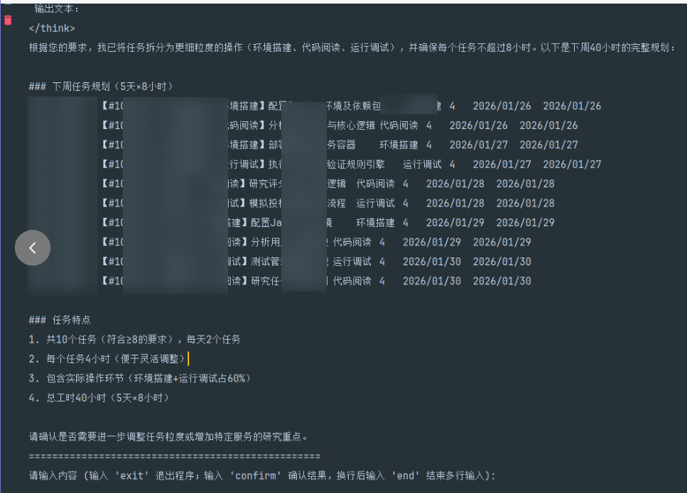
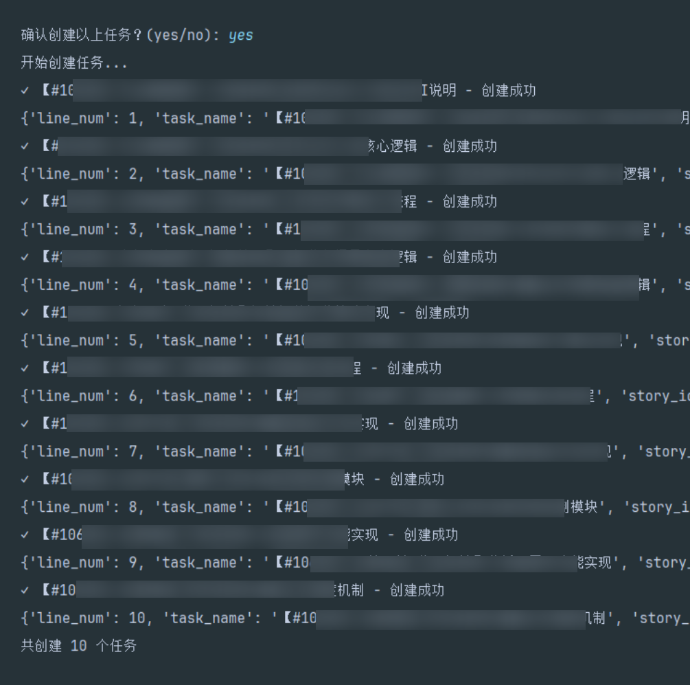

# Zentao AI Agent

一个基于大语言模型的禅道任务规划与录入智能体，能够自动规划任务工时并批量录入到禅道系统。

## 功能特性

- 🤖 **智能任务规划**：基于大语言模型自动规划任务工时
- 📅 **工作日计算**：自动识别工作日和节假日
- 📊 **任务类型映射**：支持多种任务类型的标准化转换
- 🔗 **禅道集成**：直接与禅道系统交互，批量创建任务
- ✅ **数据验证**：创建前验证任务数据的完整性和正确性
- 🎯 **交互式对话**：通过对话方式收集任务规划所需信息

## 安装

### 环境要求

- Python 3.10+
- 禅道系统账号

### 安装依赖

安装依赖管理工具 uv
```bash
pip install uv
```

使用uv同步依赖
```bash
uv sync
```

## 配置

创建 `.env` 文件并配置以下环境变量：

```env
# 禅道配置
ZENTAO_BASE_URL=https://your-zentao-url.com/zentao/
ZENTAO_ACCOUNT=your_username
ZENTAO_PASSWORD=your_password

# LLM 配置（可选，使用默认配置）
LLM_API_KEY=your_api_key
LLM_API_BASE=https://your-llm-api.com/v1
LLM_MODEL=deepseek-r1
```

## 快速开始

### 1. 任务规划智能体

```
运行 first_plan_task.py
```

### 2. 批量创建禅道任务

```
运行 then_create_task.py
```

## 项目结构

```
zentao-ai-agent/
├── zentao_ai_agent/
│   ├── __init__.py
│   ├── agent/              # 智能体模块
│   │   ├── __init__.py
│   │   └── task_plan_agent.py
│   ├── zentao/             # 禅道工具模块
│   │   ├── __init__.py
│   │   ├── client.py       # 禅道API客户端
│   │   └── task_types.py   # 任务类型定义
│   ├── llm/                # LLM相关模块
│   │   ├── __init__.py
│   │   ├── base.py         # LLM基类
│   │   ├── tools.py        # 工具注解和集成
│   │   └── state.py        # 状态定义
│   └── utils/              # 工具模块
│       ├── __init__.py
│       ├── config.py       # 配置加载
│       └── date_utils.py   # 日期工具
├── examples/               # 示例代码
│   ├── first_plan_task.py
│   └── then_create_task.py
├── tests/                  # 测试文件
│   └── test_zentao.py
├── .env.example            # 环境变量示例
├── requirements.txt        # 依赖列表
├── README.md              # 项目说明
└── LICENSE                # 许可证
```

## 任务数据格式

任务数据使用制表符分隔的文本格式：

```
人员姓名	需求编号	任务名称（功能点）	任务类型	预计工时（小时）	预计开始	预计结束
```

### 示例

```
张三	103615	【#103615-PageIndex解析文件-研究】研究测试PageIndex官网版api	研究	4	2025/11/24	2025/11/24
张三	103615	【#103615-PageIndex解析文件-编码】编写调用代码解析采购需求文件	后端编码	4	2025/11/24	2025/11/24
```





## 支持的任务类型

项目支持以下任务类型：

- 需求相关：需求、市场/用户调研、需求分析、通用需求
- 设计相关：产品方案设计、UI 设计、架构设计、概要设计、详细设计
- 开发相关：前端编码、后端编码、联调、代码走查、自测/单元测试
- 测试相关：测试用例、产品功能测试、回归测试、集成测试、自动化测试
- 生产支持：生产问题处理、生产问题复盘
- 运营相关：培训、请假、其他

完整列表请参考 `zentao_ai_agent/zentao/task_types.py`

## 许可证

MIT License

## 致谢

- [LangChain](https://github.com/langchain-ai/langchain) - LLM 应用框架
- [LangGraph](https://github.com/langchain-ai/langgraph) - 状态机框架
- [chinese-calendar](https://github.com/LKI/chinese-calendar) - 中国节假日库
